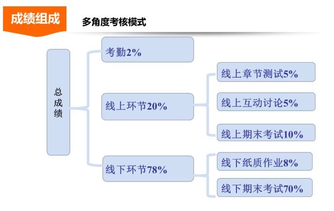

作业：海天苑大楼D座335

周二/四 13：00-14：00

# 复数
## 有关定义
规定 $i^2=-1$ 并正常参与四则运算。

有 $z=x+yi$ 中 $x,y$ 分别称为实部和虚部，记作
 $x=\operatorname{Re}(z),y=\operatorname{Im}(z).$

当 $x=0,y \ne 0$ 时称为纯虚数，而 $y=0$ 的时候我们直接看作实数。

两复数相等**当且仅当**它们的实部和虚部**分别相等**。

复数等于0**当且仅当**它的实部和虚部**同时等于0**.

> 复数中是**无法定义大小关系**的：
>
> 假设存在这样的序关系“$ > $”。
> 
> 1. 假设 $i > 0$
>    - 由乘法保序性：$i \cdot i > 0 \cdot  i\Rightarrow -1 > 0$ （矛盾）
> 
> 2. 假设 $i < 0$
>    - 则 $-i > 0$
>    - 由乘法保序性：$(-i) \cdot (-i) > 0 \cdot (-i) \Rightarrow i^2 > 0$ ⇒ $-1 > 0$ （矛盾）
> 
> 两种假设都导致 $-1 > 0$ 的矛盾，因此在复数中**无法定义**满足序关系性质的大小关系。

设两复数 $z_{1}=x_{1}+iy_{1}$，$z_{2}=x_{2}+iy_{2}$

**1. 两复数的和、差：**
$$
z_{1} \pm z_{2} = (x_{1} \pm x_{2}) + i(y_{1} \pm y_{2})
$$

**2. 两复数的积：**
$$
z_{1} \cdot z_{2} = (x_{1}x_{2} - y_{1}y_{2}) + i(x_{2}y_{1} + x_{1}y_{2})
$$

**3. 两复数的商：**
$$
\frac{z_{1}}{z_{2}} = \frac{x_{1}x_{2} + y_{1}y_{2}}{x_{2}^{2} + y_{2}^{2}} + i\frac{x_{2}y_{1} - x_{1}y_{2}}{x_{2}^{2} + y_{2}^{2}}
$$

## 共轭复数

**定义**：实部相同而虚部绝对值相等符号相反的两个复数称为共轭复数。

**表示方法**：与 $z$ 共轭的复数记为 $\bar{z}$。

**数学表达式**：
若 $z = x + iy$，则其共轭复数 $\bar{z} = x - iy$（其中 $x$, $y$ 为实数，$i$ 为虚数单位）。

> 两个共轭复数 $z,\bar{z}$ 的积是一个实数。

**四则运算**：
1. 基本运算
   - **加减法**：$\overline{z_{1} \pm z_{2}} = \bar{z}_{1} \pm \bar{z}_{2}$
   - **乘法**：$\overline{z_{1} \cdot z_{2}} = \bar{z}_{1} \cdot \bar{z}_{2}$
   - **除法**：$\overline{\left(\dfrac{z_{1}}{z_{2}}\right)} = \dfrac{\bar{z}_{1}}{\bar{z}_{2}}$

2. 自反性
   - $\overline{\bar{z}} = z$（共轭的共轭等于自身）

3. 模的平方
   - $z \cdot \bar{z} = [\operatorname{Re}(z)]^{2} + [\operatorname{Im}(z)]^{2} = |z|^2$

4. 实部与虚部提取
   - $z + \bar{z} = 2\operatorname{Re}(z)$
   - $z - \bar{z} = 2i\operatorname{Im}(z)$

# 复平面
## 定义

1. 复数 $z = x + iy$ 与有序实数对 $(x, y)$ 成一一对应。
2. 一个建立了直角坐标系的平面可以用来表示复数。这种用来表示复数的平面叫**复平面**。
3. 通常把**横轴**叫**实轴**或 $x$ 轴，**纵轴**叫**虚轴**或 $y$ 轴。

复数 $z = x + iy$ 可以用复平面上的点 $(x, y)$ 表示。
## 模
将 $z = x + iy$ 用复平面上的向量 $\overrightarrow{OP}$ 表示，此时 $|z|=\left|\overrightarrow{OP}\right|=\sqrt{x^2+y^2}.$

显然：
1. $|x|\le |z|$
2. $|y|\le |z|$
3. $|z| \le |x|+|y|$
4. $z\bar{z}=|z|^2$
## 幅角
当 $z=0$ 时，幅角**不确定**。

当 $z \ne 0$ 时：

1. 以正实轴为始边，以表示复数 $z$ 的向量 $\overrightarrow{OP}$ 为终边的角 $\theta$ 称为 $z$ 的幅角，记作 $\operatorname{Arg}z.$
2. 把满足 $-\pi<\theta_0<\pi$ 的 $\theta_0$ 称为幅角主值：
$$
\operatorname{arg}z=
\begin{cases}
\arctan \dfrac{y}{x}, & x > 0 \\
\pm \dfrac{\pi}{2}, & x = 0,y \ne 0 \\
\arctan \dfrac{y}{x}\pm \pi, & x<0,y\ne 0\\
\pi & x<0, y=0
\end{cases}
$$
其中$-\dfrac{\pi}{2}<\arctan\dfrac{y}{x}<\dfrac{\pi}{2}.$
## 平行四边形法则
平行四边形法则计算加减法与向量加减法的方法一致。

## 复数差和模的性质

因为 $|z_{1}-z_{2}|$ 表示点 $z_{1}$ 和 $z_{2}$ 之间的距离，故：

(1) $|z_{1} + z_{2}| \le |z_{1}| + |z_{2}|$ （三角不等式）

(2) $|z_{1} - z_{2}| \ge \left| |z_{1}| - |z_{2}| \right|$ （反向不等式）

一对共轭复数 $z$ 和 $\bar{z}$ 在复平面内的位置是关于实轴对称的。

## 三角表示和指数表示
利用
$
\begin{cases}
x = r\cos\theta\\
y = r\sin\theta
\end{cases}
$

将复数表示为
$$z=r(\cos\theta+i\sin\theta)\tag{三角表示}$$

再利用欧拉公式：$e^{i\theta}=\cos\theta+i\sin\theta$

我们将复数表示成：
$$z=re^{i\theta}\tag{指数表示}$$